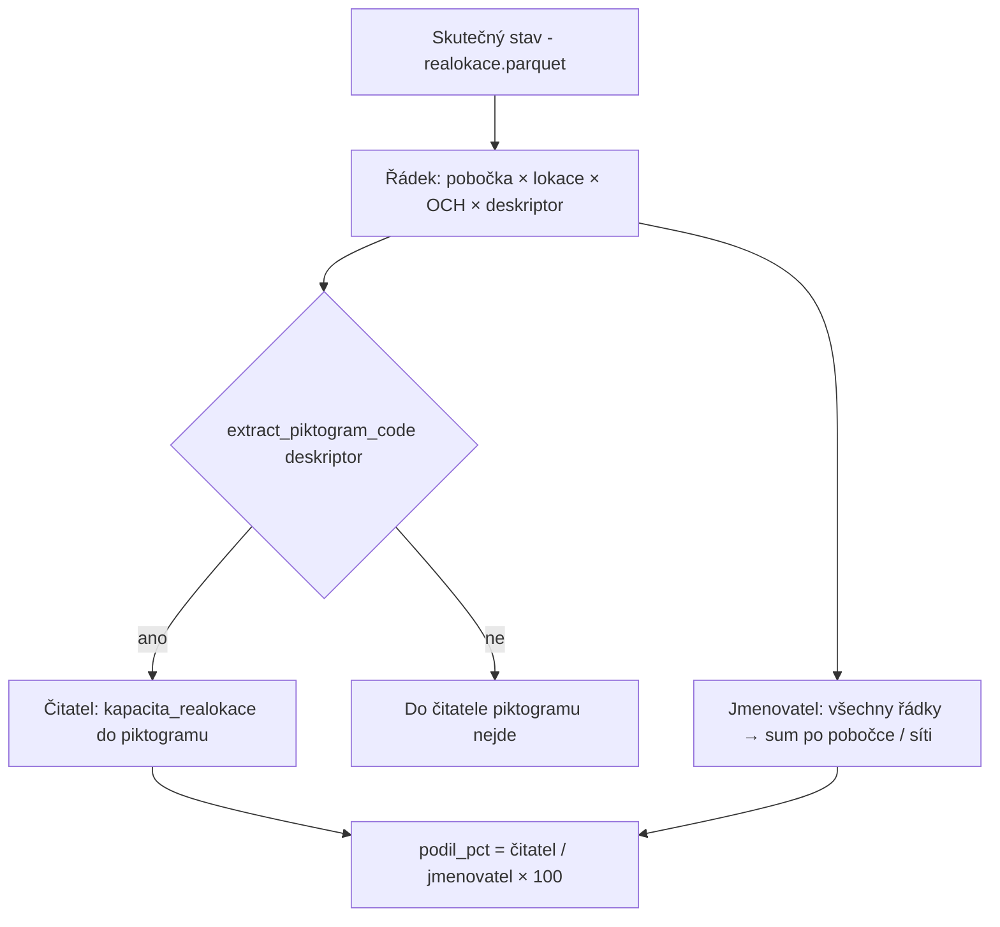

# Metriky dashboardu — podrobný popis pro tým

Tento dokument vysvětluje, **co jednotlivé čísla v dashboardu znamenají**, **jak se počítají** a **jak je interpretovat**.  
Slouží pro interní školení a pro odpovědi na otázky typu „proč se mi podíl piktogramu neshoduje s filtrem deskriptoru“.

> **Technická implementace:** `src/model/pipeline.py` (DuckDB views), `src/config.py` (whitelist piktogramů), `src/ui/dashboard.py` (zobrazení).  
> **Exporty:** `data_processed/exports/metrics_share_*.csv` po spuštění ETL.

---

## 1. Datové zdroje a „zrnitost“ řádku

Dashboard propojuje tři hlavní exporty MKP (typicky jako `*.parquet` v kořeni projektu):

| Zdroj | Soubor (typicky) | Co reprezentuje jeden řádek |
|--------|------------------|------------------------------|
| Přepočítané kapacity | `kapacity` / přepočet | Pobočka × lokace × OCH × označení × typ … |
| Skutečný stav (fond) | `skutečný stav` | Stav fondu na lokaci (agregace po OCH v detailu) |
| **Skutečný stav — realokace** | `skutečný stav - realokace` | **Pobočka × lokace × OCH × KAPACITA_DESKRIPTOR** s kapacitou plánovanou pro realokaci |

Pro **podíly OCH** a **podíly piktogramů** je rozhodující soubor **realokace**.  
Kapacita na řádku realokace = sloupec fyzické kapacity v exportu, v modelu pojmenovaný `kapacita_realokace` (počet svazků / míst na regálu dle exportu).

**Realokační lokace** (`je_realokace = Ano`) = lokace, která se vyskytuje v souboru realokace (shoda pobočka + kód lokace). Ostatní lokace jedou z přepočtu (fyzická kapacita).

---

## 2. Horní KPI (filtr vs. celá síť)

### 2.1 Horní řada — „aktuální výběr“

Po aplikaci filtrů v sidebaru (oblast, pobočka, lokace, OCH, realokace ano/ne, označení, typ, deskriptor …):

| Metrika v UI | Výpočet |
|--------------|---------|
| Přepočítaný kapacitní plán | Součet `kapacita_fyzicka_sum` po vybraných lokacích |
| Aktuální kapacitní plán | Součet `kapacita_realokace_sum` po vybraných lokacích |
| Skutečný stav | Součet `stav_fondu_celkem` |
| Naplněná kapacita (%) | `Skutečný stav / Přepočítaný plán × 100` (jen lokace s definovanou fyzickou kapacitou) |
| Zbývající kapacita | `Přepočítaný plán − Skutečný stav` |
| Počet lokací | Počet řádků v `metrics_lokace` po filtrech |

### 2.2 Blok „Celá síť — referenční KPI“

Stejné metriky, ale **bez UI filtrů** — referenční baseline pro porovnání s výběrem.

### 2.3 Přetížená / Riziková

Na úrovni **jedné lokace**:

- **Riziková** = naplnění > 90 %
- **Přetížená** = naplnění > 100 % (zároveň tedy i riziková)

---

## 3. Podílové pohledy — společná logika

V dashboardu jsou tři sekce: **OCH**, **Typ**, **Piktogramy**.

U **OCH** je navíc nad tabulkou **grouped graf** kapacitní plán vs. stav a volitelný **rozpad (prázdné)** — viz kapitola 4.  
U **Typ** a **Piktogramy** je primárně podílový graf / výběr kategorie a tabulka odchylek poboček.

Společná struktura **tabulky odchylek poboček** (pod grafy):

| Sloupec | Význam |
|---------|--------|
| **Kapacita … (svazky)** | Čitatel — součet kapacity dané kategorie na pobočce |
| **Podíl (%)** | Podíl na **pobočce** |
| **Podíl síť (%)** | Podíl v **celé síti** (stejná kategorie, stejný vzorec) |
| **Δ (pp)** | `Podíl (%) − Podíl síť (%)` v **procentních bodech** |

**Interpretace Δ:**  
- Δ > 0 → na pobočce je daná kategorie **silnější** než průměr sítě.  
- Δ < 0 → na pobočce je **slabší** než průměr sítě.

**Důležité:** Podílové tabulky **nereagují na filtry** v sidebaru. Filtry mění KPI a tabulky lokací, ne `metrics_share_*`.  
(Pokud v budoucnu potřebujete podíly „jen pro vybranou oblast“, muselo by se to doplnit zvlášť.)

---

## 4. OCH v realokaci — graf, podíly a kategorie „(prázdné)“

Sekce **Složení kapacity realokace — podíl OCH** v dashboardu má **tři vrstvy**:

1. **Hlavní grouped bar** — kapacitní plán vs. skutečný stav po OCH (síť, top 30).
2. **Rozbalovací rozpad „(prázdné)“** — co je uvnitř řádků bez vyplněného OCH.
3. **Tabulka odchylek poboček** — podíly a Δ (viz níže).

---

### 4.1 Graf „Kapacitní plán vs. skutečný stav“

Pro každé OCH ve **Skutečný stav - realokace** (síť, top 30 podle kapacity) jsou **dva sloupce**:

| Série v UI | Zdroj | Význam |
|------------|--------|--------|
| Kapacitní plán (realokace) | `SUM(kapacita_realokace)` po OCH | Plánovaná kapacita realokovatelných regálů |
| Skutečný stav (svazky) | `SUM(stav_na_regalu)` po OCH | Aktuální počet svazků na regálu (stejný export) |

**Přepínač zobrazení** (nad grafem):

| Režim | Význam |
|--------|--------|
| **Svazky** | Absolutní součty — doporučeno pro porovnání plán vs. stav u jednoho OCH. |
| **Podíl v síti (%)** | Každá série jako podíl na součtu všech OCH v síti (kapacita a stav zvlášť). |

**Naplněnost** u vybraného OCH (pod grafem):  
`SUM(stav_na_regalu) / SUM(kapacita_realokace) × 100` — může být **nad 100 %** (plán realokace, ne přepočet s koeficientem 60–70 %).

**Pohledy:** `metrics_och_realok_sit`, `metrics_och_realok_pobocka`.

Poznámka: do agregace jdou jen řádky s `kapacita_realokace IS NOT NULL`. Řádky bez kapacity, ale s vysokým stavem (např. některé skladové lokace), se v grafu neobjeví.

---

### 4.2 Co znamená sloupec **(prázdné)**

V exportu realokace **není vyplněné pole OCH** (`och` prázdné / NULL). V modelu se zobrazí jako **`(prázdné)`** — není to samostatný typ regálu ani nová kategorie fondu.

**Typická kapacita v síti (aktuální dávka):** ~**55 400** svazků plánu, ~**55 000** svazků stavu (~99 % naplněnost v rámci této skupiny).

Nejde o to samé jako:

- tabulka **16 piktogramů** (whitelist + podíl z celé realokace),
- ani o **KAPACITA_DESKRIPTOR** ve filtru (ten vybírá lokace, ne vážený součet).

OCH a deskriptor jsou **nezávislé**: řádek může mít deskriptor `E.T. (piktogram)` a přitom prázdné OCH.

---

### 4.3 Rozpad kategorie „(prázdné)“ (expander v UI)

Pod hlavním grafem: **„Rozpad kategorie (prázdné) OCH — podle deskriptoru“** (defaultně sbalený).

**Úroveň 1 — souhrnné skupiny** (vodorovný grouped bar, stejný přepínač Svazky / %):

| Skupina | Pravidlo | ~podíl kapacity v „(prázdné)“* |
|---------|----------|----------------------------------|
| Piktogram (deskriptor) | `extract_piktogram_code(KAPACITA_DESKRIPTOR)` není prázdný | ~39 % |
| Komiksy | deskriptor přesně `komiksy` | ~27 % |
| Leporela | deskriptor přesně `leporela` | ~12 % |
| Ostatní (ost.*) | deskriptor začíná `ost.` | ~10 % |
| Ostatní deskriptor | ostatní neprázdné texty | ~12 % |
| Prázdný deskriptor | prázdný `KAPACITA_DESKRIPTOR` | ~1 % |

\*Orientačně z aktuální dávky; po změně parquet se čísla posunou.

V režimu **Podíl v síti (%)** u rozpadu jde o podíl **uvnitř kategorie (prázdné)** (součet skupin = 100 %), ne o celou síť.

**Úroveň 2 — tabulka top 15 deskriptorů** — konkrétní texty (`komiksy`, `DÍVKA (piktogram)`, …) včetně kapacity, stavu a naplněnosti.

**Pohledy / exporty:** `metrics_och_prazdne_skupina_sit`, `metrics_och_prazdne_deskriptor_sit`.

---

### 4.4 Vzorec podílu (tabulka odchylek poboček)

```
Podíl OCH (%) = SUM(kapacita_realokace pro dané OCH) / SUM(kapacita_realokace všech OCH) × 100
```

- **Síť:** jmenovatel = celá realokace v síti.  
- **Pobočka:** jmenovatel = celá realokace dané pobočky.  
- Agregace podílů: `metrics_share_och_*` (z `metrics_lokace_och`).

### Příklad ze sítě (aktuální data)

**Podíly kapacity** (`metrics_share_och_sit`):

| OCH | Kapacita realokace | Podíl v síti |
|-----|-------------------:|-------------:|
| A1 | 157 756 | 28,13 % |
| (prázdné) | 55 435 | ~9,8 % |
| D | 33 555 | 5,98 % |

**Plán vs. stav** (`metrics_och_realok_sit`) — A1: ~158 tis. plán / ~202 tis. stav (~128 % naplněnost).

Součet podílů přes všechna OCH na pobočce / v síti by měl být **100 %** (každý řádek s kapacitou má OCH nebo spadá do „(prázdné)“).

### Co OCH graf a podíly **neříkají**

- Není to podíl na fyzickém přepočtu.  
- Není to počet regálů — váží se **kapacitou ve svazcích** z realokace.  
- Rozpad „(prázdné)“ nenahrazuje podílovou tabulku piktogramů (jiná pravidla a jmenovatel).

---

## 5. Podíl Typ (fyzická kapacita z přepočtu)

### Vzorec

```
Podíl Typ (%) = SUM(kapacita_fyzicka pro daný Typ) / SUM(kapacita_fyzicka všech Typů) × 100
```

Zdroj: **přepočítané kapacity** (`kapacita_raw`), sloupec `Typ` — **ne** realokace, **ne** OCH písmena.

### Příklad

| Typ | Podíl v síti (orientačně) |
|-----|---------------------------|
| Doporučujeme (dospělí) | ~0,69 % fyzické kapacity v síti* |
| Doporučujeme dětem | ~0,21 % |

\*Konkrétní číslo závisí na dávce parquet; v exportu `metrics_share_typ_sit.csv`.

### Typ vs. OCH

V datech to **nejsou totéž**: `Typ` může být např. „Beletrie - dospělí“, zatímco OCH je písmeno (A1, D, …). Porovnávejte je odděleně.

---

## 6. Podíl piktogramů (kapacita realokace) — nejdůležitější pro interpretaci

### 6.1 Co je piktogram v modelu

Whitelist **16 kódů** v `src/config.py` (`PIKTOGRAMY`).  
Z řádku realokace se kód bere z **`KAPACITA_DESKRIPTOR`** funkcí `extract_piktogram_code()`:

- přesná shoda s kódem (např. `MÁG`), nebo  
- text obsahující „piktogram“, např. `E.T. (piktogram)` → kód **E.T.**

**Nerozpozná se** mimo jiné:

- prázdný deskriptor, „komiksy“, „ost.cizi“, …  
- kombinovaný zápis **`MÁG, E.T. (piktogram)`** — parser vezme prefix před `(`, který není jedním kódem z whitelistu.

### 6.2 Vzorec (aktuální verze)

```
Podíl piktogramu (%) =
    SUM(kapacita_realokace řádků s daným piktogramem)
    / SUM(kapacita_realokace VŠECH řádků realokace na pobočce nebo v síti)
    × 100
```

- **Čitatel:** jen řádky, kde šel deskriptor namapovat na jeden z 16 kódů.  
- **Jmenovatel:** **celá** kapacita realokace pobočky / sítě (`fact_realokace_pobocka_total`), stejná logika jako u OCH.

**Součet podílů všech 16 piktogramů obvykle nedává 100 %** — většina realokace nemá v deskriptoru rozpoznatelný piktogram.  
V aktuální dávce: součet podílů piktogramů v síti ≈ **11,2 %** (zbytek jsou jiné / neparsovatelné deskriptory).

### 6.3 Proč dříve vznikaly „divné“ procenta (piktogramový pool)

Dříve byl jmenovatel jen součet kapacit **rozpoznaných** piktogramů („piktogramový pool“).  
Pak např. E.T. v síti vycházelo **~10,7 %** (podíl mezi piktogramy), což vypadalo jako velký obor, ale ve skutečnosti šlo o podíl **uvnitř malé části** realokace.

**Nově** je E.T. v síti **~1,2 % celé realokace** — srovnatelné s tím, „kolik regálové kapacity v síti je označené jako sci-fi piktogram“.

### 6.4 Rozšířený příklad: E.T. na pobočce Hostivař

**Vstupní řádky (zjednodušeně):**

| Lokace | OCH | KAPACITA_DESKRIPTOR | kapacita_realokace |
|--------|-----|---------------------|-------------------:|
| HOS-BELDO | A1 | E.T. (piktogram) | **80** |
| … | … | MILENCI (piktogram) | 330 |
| … | … | PISTOLE (piktogram) | 290 |
| … | … | další piktogramy | … |
| … | … | komiksy / prázdné / jiné | … |

**Součty:**

| Položka | Hodnota |
|---------|--------:|
| Kapacita E.T. na Hostivaři (čitatel) | **80** |
| Celá realokace Hostivaře (jmenovatel) | **8 356** |
| Kapacita všech rozpoznaných piktogramů na Hostivaři (jen pro kontext) | 1 201 |

**Výpočet v tabulce:**

```
Podíl (%)     = 80 / 8 356 × 100  ≈ 0,96 %
Podíl síť (%) = 6 817 / 567 070 × 100 ≈ 1,20 %   (E.T. v celé síti)
Δ (pp)        ≈ 0,96 − 1,20 ≈ −0,24 pp
```

**Čtení:** Na Hostivaři je E.T. o něco **slabší** než průměr sítě, ale rozdíl je malý (−0,24 pp) — ne −4 pp jako při starém jmenovateli „jen piktogramy“.

### 6.5 Příklad: největší piktogramy v síti (podíl z celé realokace)

| Piktogram | Kapacita (síť) | Podíl z celé realokace |
|-----------|---------------:|-----------------------:|
| PISTOLE | 18 162 | 3,20 % |
| MÁG | 12 505 | 2,21 % |
| MILENCI | 9 875 | 1,74 % |
| E.T. | 6 817 | 1,20 % |

### 6.6 Časté nedorozumění: filtr KAPACITA_DESKRIPTOR

| Filtr deskriptoru v sidebaru | Tabulka podílů piktogramů |
|------------------------------|---------------------------|
| Vybere **lokace**, které mají někde řádek s daným deskriptorem | Počítá **součet kapacity** řádků s piktogramem / celou realokaci |
| Nezáleží na váze kapacity lokace | Váží každý řádek realokace kapacitou |
| Může ukázat 69 lokací s textem „E.T.“ v síti | Hostivař má jen **80** svazků E.T. z **8 356** celkové realokace pobočky |

Filtr tedy odpovídá na otázku **„kde to je“**, tabulka na **„kolik to zabírá kapacity“**.

---

## 7. Schéma toku dat (piktogramy)



---

## 8. Exporty a kontrola kvality

Po ETL (`run_etl` / build modelu) vzniknou mimo jiné:

| Soubor | Obsah |
|--------|--------|
| `metrics_share_och_sit.csv` | Podíly OCH — síť |
| `metrics_share_och_pobocka.csv` | Podíly OCH — pobočky + Δ |
| `metrics_share_typ_sit.csv` | Podíly Typ — síť |
| `metrics_share_typ_pobocka.csv` | Podíly Typ — pobočky + Δ |
| `metrics_share_piktogram_sit.csv` | Podíly piktogramů — síť |
| `metrics_share_piktogram_pobocka.csv` | Podíly piktogramů — pobočky + Δ |
| `metrics_och_realok_sit.csv` | OCH — kapacitní plán vs. stav (síť) |
| `metrics_och_realok_pobocka.csv` | OCH — kapacitní plán vs. stav (pobočky) |
| `metrics_och_prazdne_skupina_sit.csv` | Rozpad „(prázdné)“ — souhrnné skupiny deskriptorů |
| `metrics_och_prazdne_deskriptor_sit.csv` | Rozpad „(prázdné)“ — detail podle deskriptoru |

Report **`data_processed/data_quality_report.md`** obsahuje součty kapacity podle OCH/Typ/piktogramu a u piktogramů poznámku k jmenovateli podílu.

---

## 9. FAQ pro diskuzi v týmu

**Proč se podíly piktogramů nesčítají na 100 %?**  
Protože jmenovatel je celá realokace, ale čitatel jen 16 rozpoznaných kódů. Zbytek jsou jiné deskriptory.

**Je podíl piktogramu stejný jako podíl OCH?**  
Ne. OCH člení **všechnu** realokaci; piktogram jen řádky s parsovatelním deskriptorem. Stejný regál může mít OCH `A1` a deskriptor `komiksy` (bez piktogramu).

**Co je ve sloupci (prázdné) v grafu OCH?**  
Řádky realokace **bez vyplněného OCH**. Nejčastěji jde o komiksy, leporela a deskriptory s textem „piktogram“, kde export nepřiřadil oborový znak. Detail je v rozbalovačce pod grafem (kapitola 4.3).

**Proč je naplněnost OCH někdy nad 100 %?**  
Graf porovnává **stav_na_regalu** s **kapacitním plánem realokace**, ne s přepočtem na 100 % kapacity regálu. To odpovídá požadavku z uživatelského testování (zaplnění regálů bez koeficientu 60–70 %).

**Můžu filtrovat podíly podle oblasti?**  
V aktuálním UI ne — podíly jsou vždy z celé sítě / všech poboček v dávce.

**Kde se bere kapacita u realokace?**  
Ze sloupce fyzické kapacity v parquet realokace, v modelu `kapacita_realokace`.

**Co když se změní parquet?**  
Streamlit cache se invaliduje podle otisku souborů; po změně dat obnovte aplikaci / redeploy.

---

## 10. Historie změn metrik

### Piktogramy — jmenovatel podílu

| Verze | Jmenovatel `podil_pct` |
|-------|------------------------|
| Původní | Součet kapacit **jen rozpoznaných piktogramů** |
| **Aktuální** | Součet **celé realokace** pobočky / sítě |

### OCH — graf a rozpad

| Verze | Chování |
|-------|---------|
| Původní | Jen podílový sloupcový graf (`podil_pct`) |
| **Aktuální** | Grouped graf **plán vs. stav** (`metrics_och_realok_*`); rozbalovací rozpad **(prázdné)** (`metrics_och_prazdne_*`); podílová tabulka poboček beze změny principu |

Při vysvětlování starších screenshotů počítejte s tímto rozdílem.

---

*Poslední aktualizace: kapitola 4 (OCH graf, prázdné, rozpad), piktogramy — `pipeline.py`, `dashboard.py`, exporty `metrics_och_*` / `metrics_och_prazdne_*`.*
